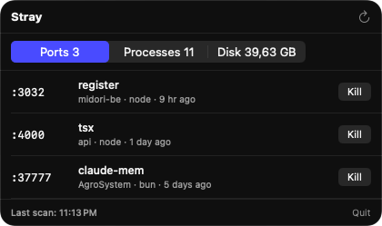
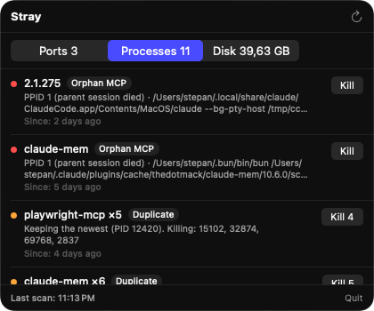
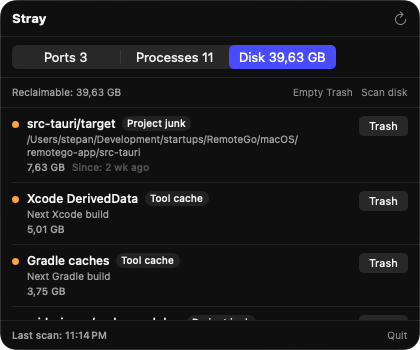

<div align="center">

# 🐾 Stray

**Hunts the processes your dev tools forgot to kill.**

A macOS menu bar app for the long-running laptop: orphaned MCP servers, duplicated agent
sessions, dead launchd agents, forgotten dev servers, and the disk they quietly eat.


Read the story: [Your AI Coding Assistant Is Leaving Processes Behind](https://medium.com/@stepannikulenko/your-ai-coding-assistant-is-leaving-processes-behind-bf2a43a658df)

</div>

---

## Why

A real audit of one laptop, on an ordinary afternoon:

```
3x  claude-mem          from a Claude Code session that ended on Tuesday
2x  context7-mcp        from a Cursor window closed hours ago
2x  playwright-mcp      nobody remembers
4x  obsidian-mcp        from Claude Desktop, quit twice since
──────────────────────
11  MCP servers         0 living parents
```

None of them were doing anything. All of them were resident. `ps aux | grep` finds them
if you already suspect they exist — the point of Stray is that you don't.

## What it looks like

<div align="center">

</div>

> `:3000` is taken and you don't know by what. That is the question this tab exists to
> answer, without a trip to `lsof`.

<table>
<tr>
<td width="50%"></td>
<td width="50%"></td>
</tr>
<tr>
<td align="center"><sub><b>Processes</b> — orphans and duplicates, with the evidence</sub></td>
<td align="center"><sub><b>Disk</b> — caches and build junk, sized on demand</sub></td>
</tr>
</table>

## What it finds

| # | Rule | Signal |
|---|------|--------|
| 1 | **Orphan MCP servers** | `PPID == 1` and the command line matches MCP tooling (`/_npx/`, `-mcp`, `mcp-server`, `/.claude/`) |
| 2 | **Duplicate instances** | Same server name, multiple process trees, started more than an hour apart |
| 3 | **Orphan runtimes** | `node` / `bun` / `deno` reparented to launchd and up for over 24h |
| 4 | **Orphan LaunchAgents** | `~/Library/LaunchAgents/*.plist` pointing at a binary that no longer exists |
| 5 | **Listening ports** | Every JS dev server holding a TCP socket in `LISTEN` — stale or not |
| 6 | **Reclaimable disk** | 15 known tool caches, plus `node_modules`, `.next`, `.venv`, `target`, `build` |

Rules 1–4 are judgements and produce findings. Rule 5 is not: every listening dev server
is shown, because the question is *"what is on :3000"*, not *"what do I think is garbage"*.

## Build

`Stray.xcodeproj` is generated and git-ignored, so `xcodegen` is required, not optional:

```bash
brew install xcodegen
git clone git@github.com:steppannws/Stray.git && cd Stray
xcodegen generate
open Stray.xcodeproj    # ⌘R
```

The app has no Dock icon (`LSUIElement`). Look for the paw in the menu bar.

```bash
cd StrayCore && swift test   # 88 tests, no app host, no simulator
```

## How it works

**Ports come from `libproc`, not `lsof`.** Stray walks each PID's file descriptors, keeps
the sockets, keeps the TCP ones, keeps those in `LISTEN`. Same walk `lsof -iTCP
-sTCP:LISTEN` does, in-process: no subprocess per refresh, and nothing to break if `lsof`
is missing or sandboxed. A server bound to both `0.0.0.0` and `[::]` holds two sockets on
one port and collapses to one row, because it is one thing to kill.

**One pass, one timer.** The port walk reuses the PID set the process scan just gathered
rather than enumerating twice. Working directories cost a syscall each, so they are read
only for the few PIDs that turned out to be listening.

**Disk is manual, always.** Process scanning is cheap and runs every 5 minutes. Walking
project trees is not, so it never happens on a timer — only when you ask.

## Safety

The app deletes things, so the rules about deleting are the design:

- **Never auto-kill.** Every action shows its evidence — parent, uptime, full command
  line — and needs an explicit confirm. A false positive is worse than a stray process.
- **`SIGTERM`, then `SIGKILL`** only after the grace period, including when a reclaim
  command overruns its timeout.
- **Trash over `rm`** wherever the operation can be reversible. `Finding.isReversible`
  marks which is which, and Empty Trash needs a modal confirm.
- **A `.venv` needs a manifest.** No `requirements.txt` / `pyproject.toml` nearby, no
  offer to delete it.
- **`ReclaimGuard`** refuses a confirm whose path shifted between being shown and being
  clicked.

## Architecture

```
StrayCore/          SPM package — scanning, sizing, reclaim. Pure, headless, tested.
├── ProcessScanner  libproc + sysctl: the process table
├── PortScanner     libproc: listening TCP sockets
├── Rules           rules 1–3; the actual product
├── LaunchdScanner  rule 4
├── PortRow         rule 5 — joins processes to ports, pure and testable
├── ReclaimGuard    refuses stale confirms
└── Disk/           catalog, walker, sizer, reclaimer

Stray/              SwiftUI MenuBarExtra. Renders StrayCore, owns no logic.
```

The core used to live in the app target, which meant its tests needed the app as a test
host — so they could never run headlessly or in CI, on code whose entire job is to
irreversibly delete files. Splitting it out fixed that.

**Rules are the product.** Scanning is commodity: `libproc` and `sysctl` do it. The value
is in `Rules.swift`. New heuristics go there.

**No App Sandbox, on purpose.** A sandboxed app cannot enumerate other processes or manage
launchd, which is the entire feature set. That rules out the Mac App Store and TestFlight;
direct distribution with notarization is the path, same as Pearcleaner and Stats.

## Roadmap

- [ ] Developer ID signing + notarization, so builds open without `xattr` gymnastics
- [ ] Privileged helper via `SMAppService.daemon` for `/Library/LaunchDaemons`
- [ ] Per-rule whitelist and custom patterns
- [ ] Launch at login
- [ ] Sparkle auto-updates
